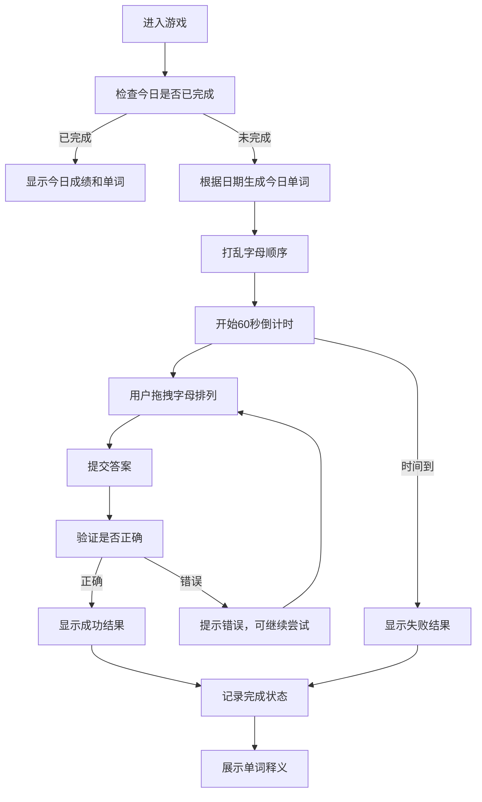

## 1. 产品概述

每日单词拼图是一款轻量级的英语单词学习小游戏，系统每天从词库中随机选择一个英文单词，打乱字母顺序展示给玩家，玩家需要在60秒内通过拖拽字母的方式拼出正确的单词。

- 主要目的：通过游戏化方式帮助用户记忆和拼写英语单词
- 目标用户：英语学习者、词汇爱好者、休闲游戏玩家
- 产品价值：每日一题，轻量化学习，寓教于乐，培养每日学习习惯

## 2. 核心功能

### 2.1 用户角色

| 角色 | 注册方式 | 核心权限 |
|------|----------|----------|
| 普通用户 | 无需注册，直接使用 | 每日挑战、查看单词释义、查看历史记录 |

### 2.2 功能模块

1. **游戏主页面**：今日单词拼图、倒计时、字母拖拽区、答案区
2. **结果展示**：成功/失败提示、单词释义、用时统计
3. **历史记录**：每日完成记录、连续打卡天数

### 2.3 页面详情

| 页面名称 | 模块名称 | 功能描述 |
|----------|----------|----------|
| 游戏主页 | 顶部信息栏 | 显示今日日期、连续打卡天数、倒计时 |
| 游戏主页 | 单词提示区 | 显示单词长度提示、单词释义（可选提示） |
| 游戏主页 | 字母拖拽区 | 打乱的字母卡片，可拖拽到答案区 |
| 游戏主页 | 答案区 | 放置已选择的字母，可拖回或调整顺序 |
| 游戏主页 | 操作按钮 | 提交答案、重置、提示按钮 |
| 结果弹窗 | 结果展示 | 显示成功/失败、正确答案、单词释义、用时 |
| 结果弹窗 | 分享/再来 | 分享成绩、查看明天（第二天才能玩） |

## 3. 核心流程

用户进入游戏 → 系统根据日期生成今日单词 → 字母打乱展示 → 用户拖拽字母排列 → 提交答案验证 → 显示结果和单词释义 → 记录今日完成状态

## 4. 用户界面设计

### 4.1 设计风格

- **主色调**：温暖的橙黄色系（#FF6B35）搭配清新的蓝绿色（#00B4D8），营造活泼有趣的游戏氛围
- **辅助色**：米白色背景（#FFF8F0），深灰色文字（#2D3142）
- **按钮风格**：圆角卡片式按钮，带有轻微阴影和按压效果
- **字体**：使用圆润友好的无衬线字体，字母卡片使用等宽字体增强可读性
- **布局风格**：卡片式布局，居中展示，周围有充足留白
- **图标风格**：简洁的线性图标，配合emoji增加趣味性

### 4.2 页面设计概述

| 页面名称 | 模块名称 | UI元素 |
|----------|----------|--------|
| 游戏主页 | 顶部信息栏 | 日期标签、火焰图标+连续天数、倒计时圆环 |
| 游戏主页 | 单词提示区 | 下划线占位符、提示灯泡按钮、中文释义（模糊显示） |
| 游戏主页 | 字母拖拽区 | 彩色字母卡片、拖拽时缩放效果、阴影 |
| 游戏主页 | 答案区 | 虚线框占位、已放置的字母卡片 |
| 游戏主页 | 操作区 | 重置按钮、提交按钮、提示按钮 |
| 结果弹窗 | 结果展示 | 大图标（🎉/😢）、结果文字、用时、正确单词 |
| 结果弹窗 | 单词学习 | 音标、中文释义、例句 |
| 结果弹窗 | 底部操作 | 分享按钮、明日再来 |

### 4.3 响应式

- 桌面端优先设计，适配平板和移动端
- 移动端字母卡片适当缩小，保证触控区域足够大
- 拖拽操作支持触屏拖动
- 整体布局在小屏幕上垂直堆叠

### 4.4 交互动效

- 字母卡片拖拽时有缩放和阴影加深效果
- 放置到答案区时有弹入动画
- 倒计时最后10秒变红并闪烁
- 答案正确时有庆祝动画（彩带、弹跳效果）
- 页面加载有渐入动画
