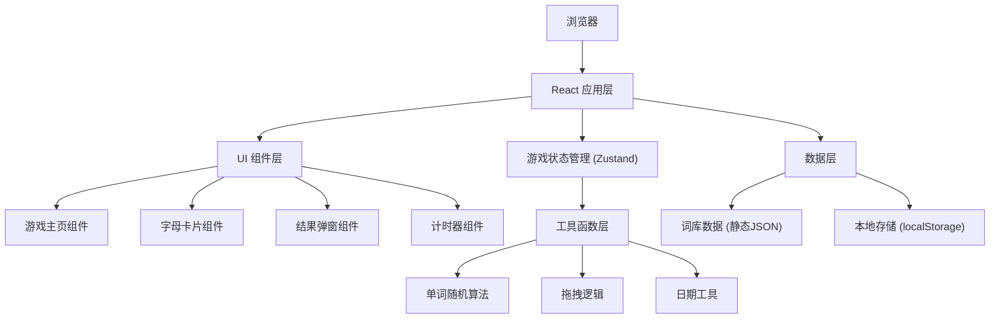

## 1. 架构设计

这是一个纯前端应用，无需后端服务。使用本地存储（localStorage）保存用户游戏记录。



## 2. 技术描述

- **前端框架**：React 18 + TypeScript
- **构建工具**：Vite 5
- **样式方案**：Tailwind CSS 3
- **状态管理**：Zustand
- **拖拽实现**：原生 HTML5 Drag and Drop API + 触屏适配
- **图标库**：Lucide React
- **数据存储**：localStorage（无需后端）
- **初始化工具**：vite-init

## 3. 目录结构

```
src/
├── components/          # 组件目录
│   ├── GameBoard.tsx    # 游戏主面板
│   ├── LetterCard.tsx   # 字母卡片
│   ├── AnswerSlot.tsx   # 答案槽位
│   ├── Timer.tsx        # 倒计时器
│   ├── ResultModal.tsx  # 结果弹窗
│   └── Header.tsx       # 顶部信息栏
├── hooks/               # 自定义Hooks
│   ├── useGame.ts       # 游戏逻辑Hook
│   └── useDragDrop.ts   # 拖拽逻辑Hook
├── data/                # 数据
│   └── words.ts         # 词库数据
├── utils/               # 工具函数
│   ├── shuffle.ts       # 打乱算法
│   ├── dateUtils.ts     # 日期工具
│   └── storage.ts       # 本地存储封装
├── store/               # 状态管理
│   └── useGameStore.ts  # 游戏状态Store
├── types/               # 类型定义
│   └── index.ts         # 类型声明
├── App.tsx              # 主应用组件
├── main.tsx             # 入口文件
└── index.css            # 全局样式
```

## 4. 核心数据类型定义

```typescript
interface Word {
  word: string;
  meaning: string;
  phonetic?: string;
  example?: string;
}

interface GameState {
  currentWord: Word | null;
  shuffledLetters: string[];
  answerLetters: (string | null)[];
  timeLeft: number;
  gameStatus: 'idle' | 'playing' | 'success' | 'failed';
  streak: number;
  lastPlayDate: string | null;
  hintsUsed: number;
}

interface GameRecord {
  date: string;
  word: string;
  success: boolean;
  timeUsed: number;
  hintsUsed: number;
}
```

## 5. 核心功能实现方案

### 5.1 每日单词生成
- 使用日期字符串作为随机种子
- 通过种子从词库中确定性地选择单词
- 保证同一天内所有用户看到同一个单词

### 5.2 拖拽实现
- 使用 HTML5 Drag and Drop API 实现桌面端拖拽
- 监听 touch 事件实现移动端触屏拖拽
- 字母卡片可在拖拽区和答案区之间双向移动

### 5.3 倒计时
- 使用 setInterval 实现60秒倒计时
- 最后10秒视觉警告（红色+闪烁）
- 时间到自动判负

### 5.4 本地存储
- 存储每日游戏记录
- 存储连续打卡天数
- 存储用户设置

## 6. 词库数据

- 内置约100个常用英语单词
- 每个单词包含：单词、中文释义、音标、例句
- 单词难度适中（4-8个字母）
- 数据以静态 TypeScript 数组形式存在
